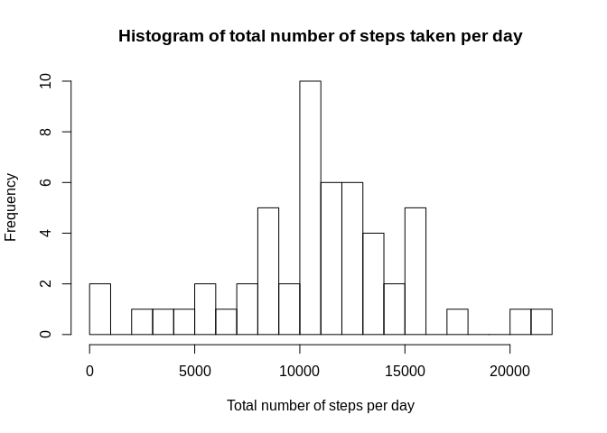
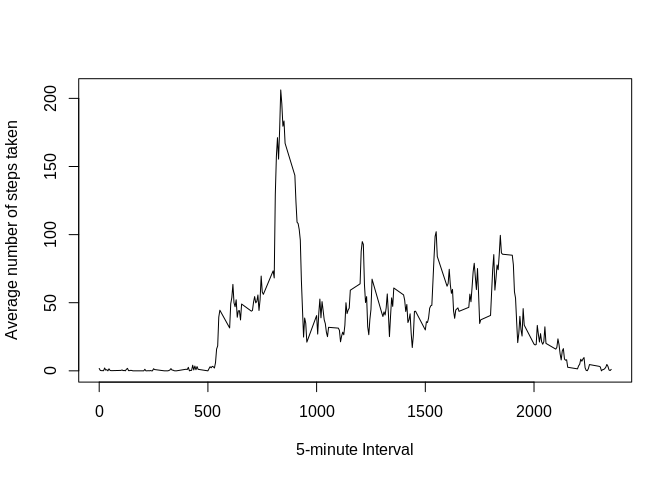
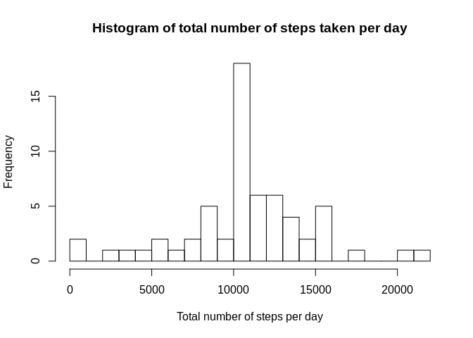
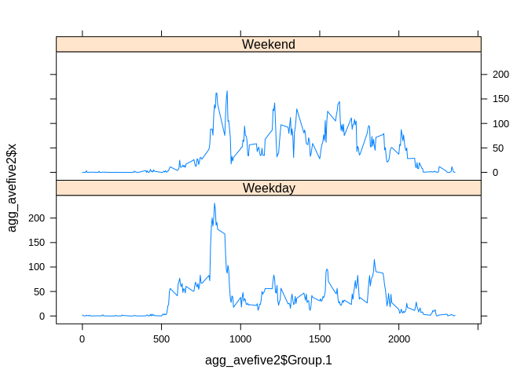

---
title: "Reproducible Research: Peer Assessment 1"
output: 
  html_document:
    keep_md: true
---

## Loading and preprocessing the data
1. Load the data (i.e. read.csv())
2. Process/transform the data (if necessary) into a format suitable for your analysis

```r
activity = read.csv(file = "activity.csv")
summary(activity)
```

```
##      steps                date          interval     
##  Min.   :  0.00   2012-10-01:  288   Min.   :   0.0  
##  1st Qu.:  0.00   2012-10-02:  288   1st Qu.: 588.8  
##  Median :  0.00   2012-10-03:  288   Median :1177.5  
##  Mean   : 37.38   2012-10-04:  288   Mean   :1177.5  
##  3rd Qu.: 12.00   2012-10-05:  288   3rd Qu.:1766.2  
##  Max.   :806.00   2012-10-06:  288   Max.   :2355.0  
##  NA's   :2304     (Other)   :15840
```


## What is mean total number of steps taken per day?
1. Calculate the total number of steps taken per day
2. If you do not understand the difference between a histogram and a barplot, research the difference between them. Make a histogram of the total number of steps taken each day

```r
agg_totalsteps = aggregate(activity$steps, by = list(activity$date), FUN = sum)
hist(agg_totalsteps$x, main = "Histogram of total number of steps taken per day",xlab = "Total number of steps per day", breaks = 20)
```

<!-- -->

3. Calculate and report the mean and median of the total number of steps taken per day

```r
mean(agg_totalsteps$x, na.rm = TRUE)
```

```
## [1] 10766.19
```

```r
median(agg_totalsteps$x, na.rm = TRUE)
```

```
## [1] 10765
```

## What is the average daily activity pattern?
1. Make a time series plot (i.e. type = "l") of the 5-minute interval (x-axis) and the average number of steps taken, averaged across all days (y-axis)

```r
agg_avefive = aggregate(activity$steps, by = list(activity$interval), FUN = mean, na.rm = TRUE)
plot(agg_avefive$Group.1,agg_avefive$x, type = "l", xlab = "5-minute Interval",ylab = "Average number of steps taken")
```

<!-- -->

2. Which 5-minute interval, on average across all the days in the dataset, contains the maximum number of steps?

```r
agg_avefive$Group.1[match(max(agg_avefive$x),agg_avefive$x)]
```

```
## [1] 835
```
Given this interval, it means that the highest average steps taken occur between 8:35AM to 8:40.

## Imputing missing values
Note that there are a number of days/intervals where there are missing values (coded as NA). The presence of missing days may introduce bias into some calculations or summaries of the data.

1. Calculate and report the total number of missing values in the dataset (i.e. the total number of rows with NA)

```r
sum(is.na(activity$steps))
```

```
## [1] 2304
```
2. Devise a strategy for filling in all of the missing values in the dataset. The strategy does not need to be sophisticated. For example, you could use the mean/median for that day, or the mean for that 5-minute interval, etc.

3. Create a new dataset that is equal to the original dataset but with the missing data filled in.

For this part, I used the mean for of the 5-minute intervals and subtitute it to the missing values. Note that steps are taken as integers.

```r
complete_activity = activity
i = 1
while (i <= length(complete_activity$steps)) {
  if(is.na(complete_activity$steps[i]) == TRUE){
      intervl = complete_activity$interval[i]
      a = match(intervl, agg_avefive$Group.1)
      complete_activity$steps[i] = floor(agg_avefive$x[a])
  }
  i = i + 1
}
```
4. Make a histogram of the total number of steps taken each day and Calculate and report the mean and median total number of steps taken per day. Do these values differ from the estimates from the first part of the assignment? What is the impact of imputing missing data on the estimates of the total daily number of steps?


```r
agg_totalsteps2 = aggregate(complete_activity$steps, by = list(complete_activity$date), FUN = sum)
hist(agg_totalsteps2$x, main = "Histogram of total number of steps taken per day",xlab = "Total number of steps per day", breaks = 20)
```

<!-- -->


```r
mean(agg_totalsteps2$x)
```

```
## [1] 10749.77
```

```r
median(agg_totalsteps2$x)
```

```
## [1] 10641
```

We can see in the histogram that the frequencies of the total number of steps taken per day have increased. Though the mean and average daily steps have decreased since I assumed the steps in the missing value to be round down using floor function.

## Are there differences in activity patterns between weekdays and weekends?
1. Create a new factor variable in the dataset with two levels – “weekday” and “weekend” indicating whether a given date is a weekday or weekend day.


```r
complete_activity$weekday <- NA
weekdy = weekdays(as.Date(complete_activity$date))
wekday = c(grep("*Monday", weekdy),grep("*Tuesday", weekdy),grep("*Wednesday", weekdy),grep("*Thursday", weekdy),grep("*Friday", weekdy))
wekend = c(grep("*Saturday", weekdy),grep("*Sunday", weekdy))

complete_activity$weekday[wekday] = "Weekday"
complete_activity$weekday[wekend] = "Weekend"

complete_activity$weekday = factor(complete_activity$weekday)
summary(complete_activity)
```

```
##      steps                date          interval         weekday     
##  Min.   :  0.00   2012-10-01:  288   Min.   :   0.0   Weekday:12960  
##  1st Qu.:  0.00   2012-10-02:  288   1st Qu.: 588.8   Weekend: 4608  
##  Median :  0.00   2012-10-03:  288   Median :1177.5                  
##  Mean   : 37.33   2012-10-04:  288   Mean   :1177.5                  
##  3rd Qu.: 27.00   2012-10-05:  288   3rd Qu.:1766.2                  
##  Max.   :806.00   2012-10-06:  288   Max.   :2355.0                  
##                   (Other)   :15840
```
2. Make a panel plot containing a time series plot (i.e. type = "l") of the 5-minute interval (x-axis) and the average number of steps taken, averaged across all weekday days or weekend days (y-axis).

```r
agg_avefive2 = aggregate(complete_activity$steps, by = list(complete_activity$interval,complete_activity$weekday), FUN = mean, na.rm = TRUE)
library(lattice)
xyplot(agg_avefive2$x ~ agg_avefive2$Group.1| agg_avefive2$Group.2, layout = c(1,2), type = "l")
```

<!-- -->

We can infer based on the plot that the average number of steps taken during office hour in weekdays is smaller compared to that of weekends.
